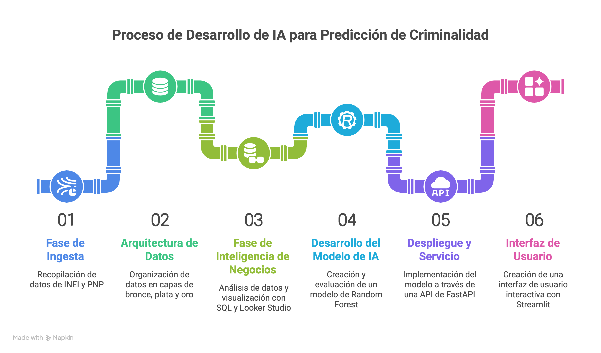

# Sistema Inteligente de Seguridad Ciudadana



## 1. Introducción y Propósito

Este proyecto consiste en el desarrollo de un sistema de alerta temprana basado en Machine Learning, diseñado para modelar la relación entre factores macroeconómicos y la evolución de la seguridad ciudadana en el Perú.

El objetivo principal es integrar y procesar datos provistos por entidades gubernamentales (INEI, PNP y BCRP) para formular una herramienta que permita a analistas y tomadores de decisiones simular escenarios económicos y evaluar su impacto en el volumen de denuncias mensuales a nivel nacional.

## 2. Stack Tecnológico

La herramienta fue desarrollada aplicando metodologías de ingeniería de software orientadas a la mantenibilidad y el rendimiento:

- **Lenguaje:** Python 3.9+
- **Machine Learning:** `scikit-learn` (Random Forest Regressor), `pandas` y `numpy` para el procesamiento y modelado de las bases de datos.
- **API Backend:** `FastAPI` estructurado bajo Clean Architecture. Se utilizó la inyección de dependencias y el almacenamiento en caché (`@lru_cache`) para optimizar el rendimiento de la inferencia del modelo.
- **Interfaz de Usuario (Frontend):** `Streamlit` y `Plotly` para proporcionar una interfaz interactiva y de visualización analítica.
- **Inteligencia de Negocios (BI):** `Looker Studio` y Google BigQuery, empleados durante la fase inicial de análisis exploratorio de datos (EDA).

## 3. Arquitectura del Modelo e Ingeniería de Características

El componente predictivo emplea un algoritmo Random Forest para capturar relaciones lineales y no-lineales. El desempeño del algoritmo se basó en una ingeniería de características específica:

- **Rezagos Temporales (Lags):** Dado que la correlación entre las variables económicas y la criminalidad presenta retrasos temporales, el modelo fue entrenado utilizando el Índice de Precios al Consumidor (IPC) y la Tasa de Desempleo con rezagos de 1 a 3 meses, sustentados por un análisis previo de Lead-Lag.
- **Inercia delictiva:** Se incorporaron medias móviles trimestrales para proveer al modelo del contexto sobre la tendencia a corto plazo en el índice de denuncias.
- **Anomalías Estructurales:** Se utilizó una variable binaria paramétrica (asociada al Estado de Emergencia por COVID-19) como factor de control para absorber distorsiones externas, permitiendo modelar escenarios de medidas restrictivas excepcionales.

## 4. Resultados y Evaluación de Métricas

El proceso de sintonización y ajuste de hiperparámetros se llevó a cabo utilizando validación cruzada temporal (_TimeSeriesSplit_).

- **Comparación:** El modelo Random Forest propuesto demostró un Error Porcentual Absoluto Medio (MAPE) del **3.99%**, logrando una precisión mayor en comparación con los modelos econométricos tradicionales como SARIMAX (que obtuvieron un MAPE base de 9.36%).
- **Varianza Explicada:** El desarrollo final obtuvo un coeficiente de determinación **$R^2$ de 0.5051**, logrando explicar más de la mitad de la varianza en las cifras de criminalidad basándose únicamente en indicadores macroeconómicos.

## 5. Funcionalidades del Simulador

La interfaz de usuario despliega capacidades de simulación modular:

- **Modos de Simulación:** Permite proyectar el impacto de las variables a nivel de siguiente periodo (Modo Simple) o como crisis estacionaria o prolongada (Modo Shock). Este último inyecta ajustes fundamentados en distorsiones histórico-probabilísticas calculadas a partir del impacto del IPC ($\pm 1.5\sigma$).
- **Nivel de Riesgo:** La salida de la predicción contrasta dinámicamente con la distribución empírica original del vector de denuncias, utilizando un marco de validación por percentiles. Superar el percentil 75 ($P_{75}$) activa categorizaciones visuales de riesgo alto, orientando a la acción rápida.

## 6. Guía de Instalación y Uso

### Clonación y Configuración Inicial

Descargar el repositorio y ubicarse en el directorio principal:

```bash
git clone https://github.com/YomelBarretoFlores/crimen-prediction.git
cd crimen-prediction
```

### Entorno Virtual e Instalación de Dependencias

```bash
python -m venv venv
# Activar entorno virtual
# MacOS/Linux: source venv/bin/activate
# Windows: venv\Scripts\activate

pip install -e .
```

### Inicialización Local del Proyecto

**1. Servidor Backend:**

```bash
uvicorn backend.main:app --reload
```

_La documentación automática de la API y los servicios estará disponible en `http://localhost:8000/docs`._

**2. Panel Interactable (Frontend):**
En una terminal por separado, ejecutar Streamlit:

```bash
streamlit run frontend/app.py
```

_El sistema se renderizará en el ambiente de escritorio bajo `http://localhost:8501`._

## 7. Enlaces

- **Plataforma Web (Despliegue):** [https://crimen-prediction.streamlit.app](https://crimen-prediction.streamlit.app)
- **Visualización de Datos (EDA):** [https://lookerstudio.google.com/s/uKdSgLZupU4](https://lookerstudio.google.com/s/uKdSgLZupU4)
- **Documentación Académica:** Revisa el documento formal adjunto ([Predicción-Crimen-Perú.pdf](./docs/Predicción-Crimen-Perú.pdf)) para auditar la matematización del modelo y el sustento académico de la investigación de tesis.

---

## Integridad Predictiva y Flujo Arquitectónico

La solidez técnica del simulador recae en la integridad trazable existente entre la visualización en pantalla y el origen subyacente de cada predicción estadística.

Al configurar un escenario en la interfaz, los parámetros transitan hacia un motor de cálculo backend que no solamente aplica el modelo, sino que actualiza todas las variables inerciales pre-codificadas en el entrenamiento inicial. Al devolver la respuesta hacia el usuario final, el frontend extrae sincrónicamente el contexto histórico original de la API de FastAPI.

Esto garantiza que las visualizaciones gráficas interactivas y las bandas probabilísticas ($\pm 1\sigma$) del entorno reactivo mantengan una estricta coherencia semántica frente a los márgenes empíricos dictados por los datos originales, evitando discrepancias de inferencia originadas por representaciones asimétricas de las matrices frontend-backend.
